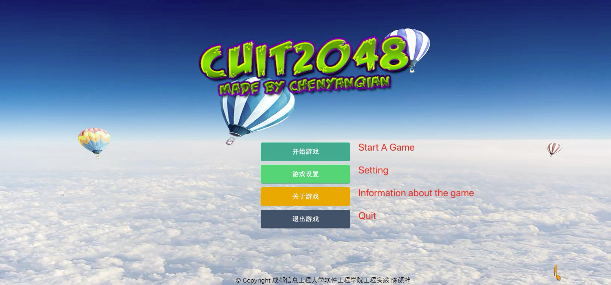
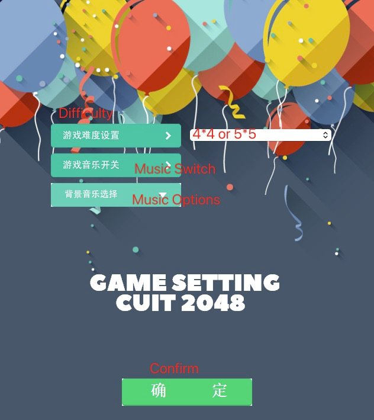
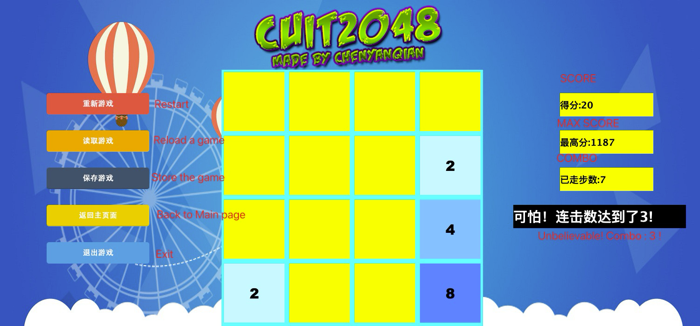

# Game 2048
## Introduction
A Java practice project, written in **2017**, a 2048 small game developed based on JavaGUI.

2048 is a single-player sliding block puzzle game designed by Italian web developer Gabriele Cirulli. The game's objective is to slide numbered tiles on a grid to combine them to create a tile with the number 2048. However, one can continue to play the game after reaching the goal, creating tiles with larger numbers.
## Installation
1. Clone the repository
```shell
    git clone https://github.com/moumchen/game2048.git
```
2. Open the project in IDEA
3. Run the `Game2048` class

## Features
### Main Page: 

### Setting

### Game Page
